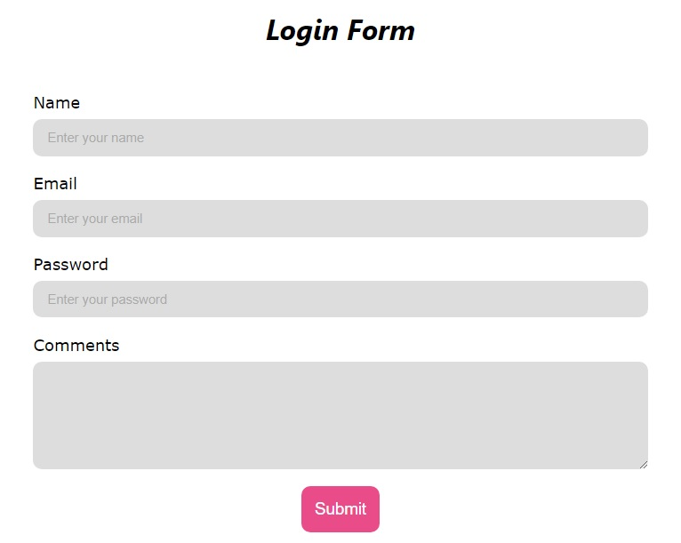

# *The Login Form Exercise*

  

Este proyecto fue creado con [Create React App](https://github.com/facebook/create-react-app).

La aplicación al iniciar, muestra un formulario tipo Login, que posee tres inputs para ingresar nombre, email y password. Estos campos son obligatorios y está validado el tipo de dato ingresado, no se permite hacer el submit mientras haya errores. Ademas hay un campo para agregar comentarios, el cual no es obligatorio.

Al hacer submit se abre un modal que muestra la info en formato tipo JSON.

## **Librerías**

Se usó Formik para el manejo del formulario y Yup para la validación. Se usó un portal para implementar el modal. Para los estilos se utilizó styled-components.

## **Probar la aplicación en modo desarrollo**

Puedes descargar una copia del repositorio -> [Repositorio](https://github.com/Ernest2104/challenge_form)

__IMPORTANTE:__ Es necesario contar minimamente con la última versión estable de Node y NPM. Asegurarse de contar con ella para poder instalar correctamente las dependecias necesarias para correr la aplicación.

En el directorio del proyecto debes correr:

### `npm install` 

para instalar las dependencias, y luego:

### `npm start`

Abre [http://localhost:3000](http://localhost:3000) para ver la aplicación en tu navegador.

## **Probar la aplicación en producción**

Abre https://calm-hummingbird-369f6d.netlify.app para ver la aplicación deployada en tu navegador.